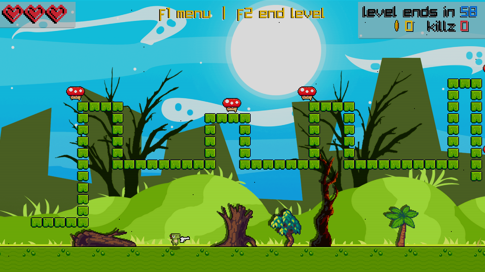
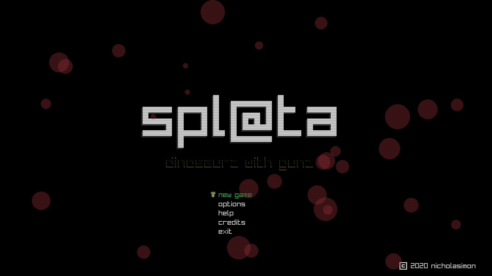

# arcade_game_golang
An almost complete arcade shooter with roguelike random level generation called Spl@ta made with go/golang and raylib . The game is just about playable though there are a lot of fixes needed to complete.  

  

  

